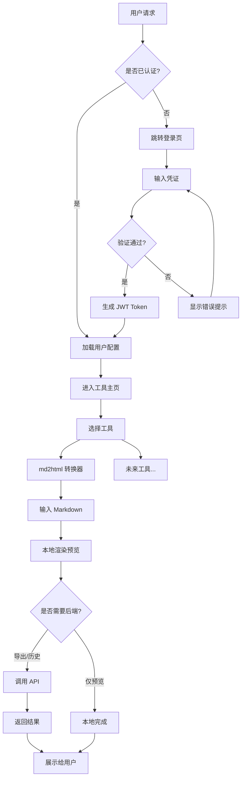
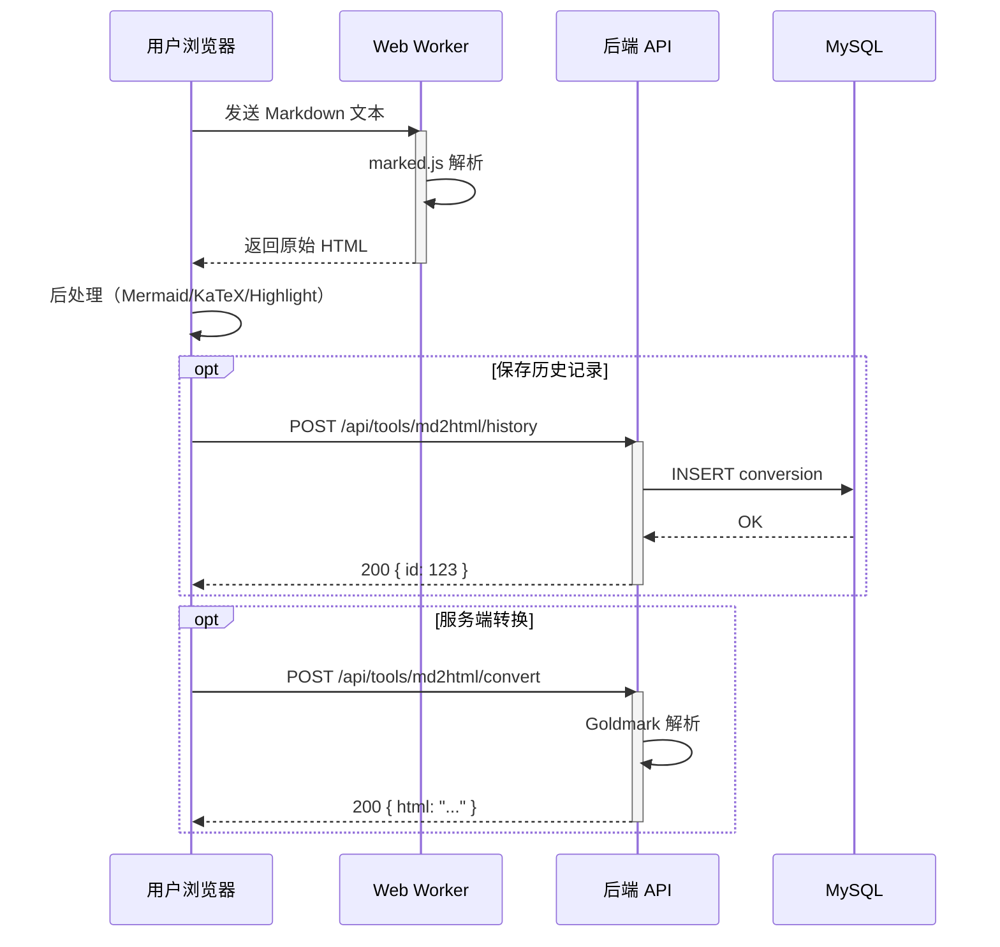
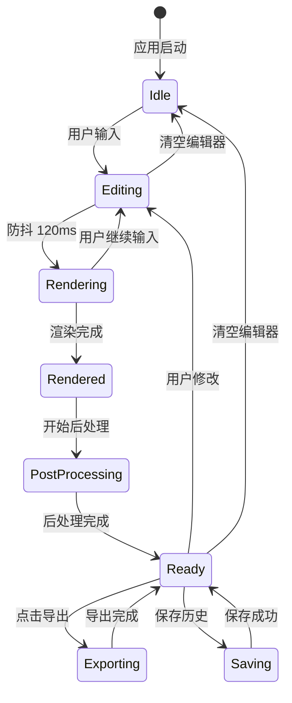
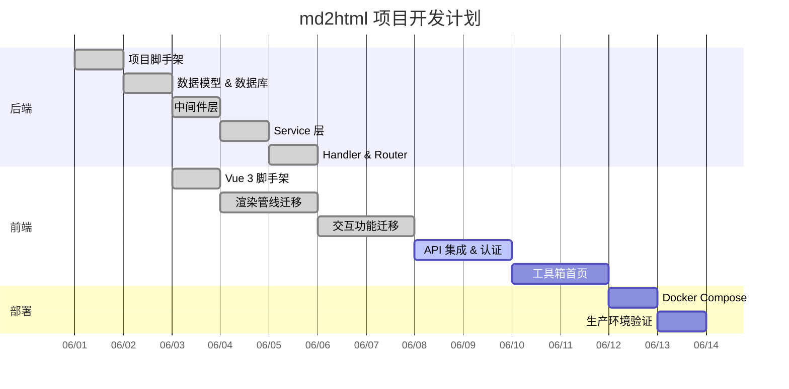
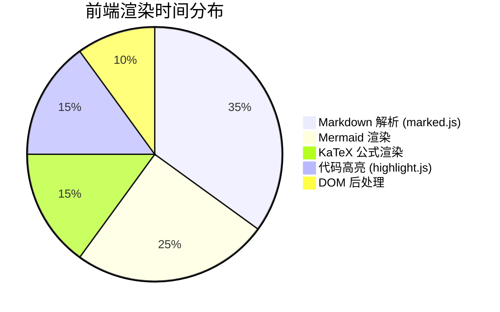
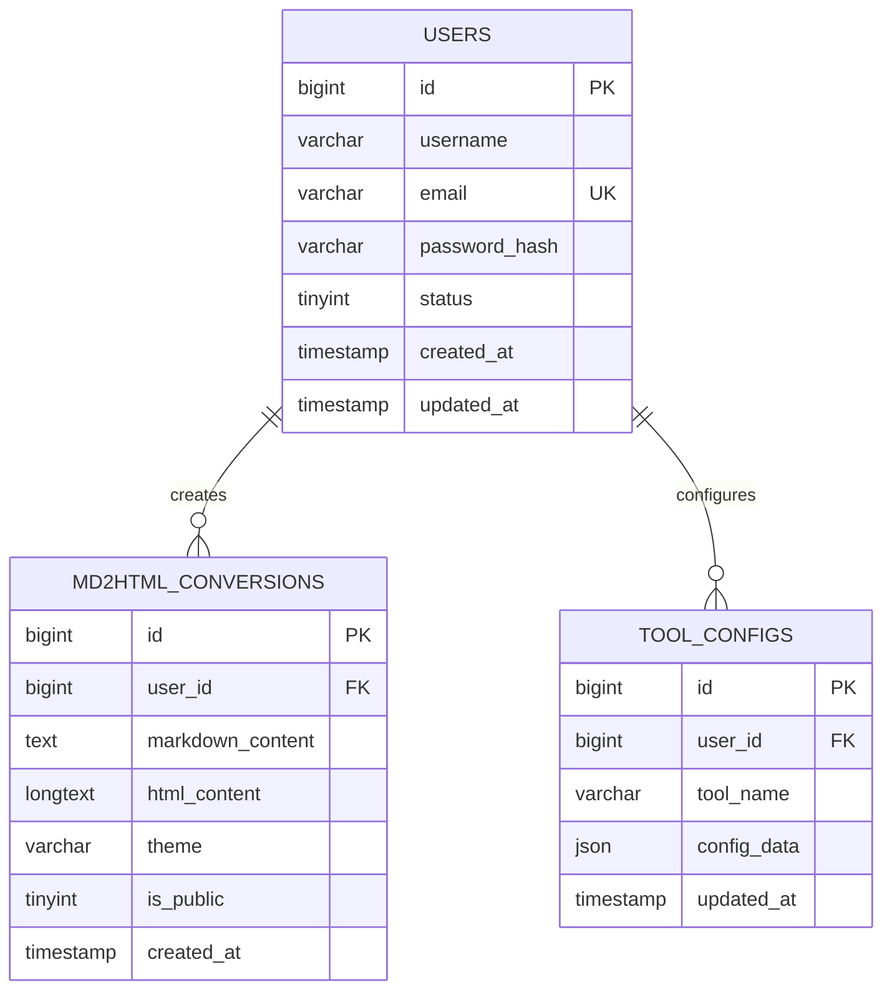
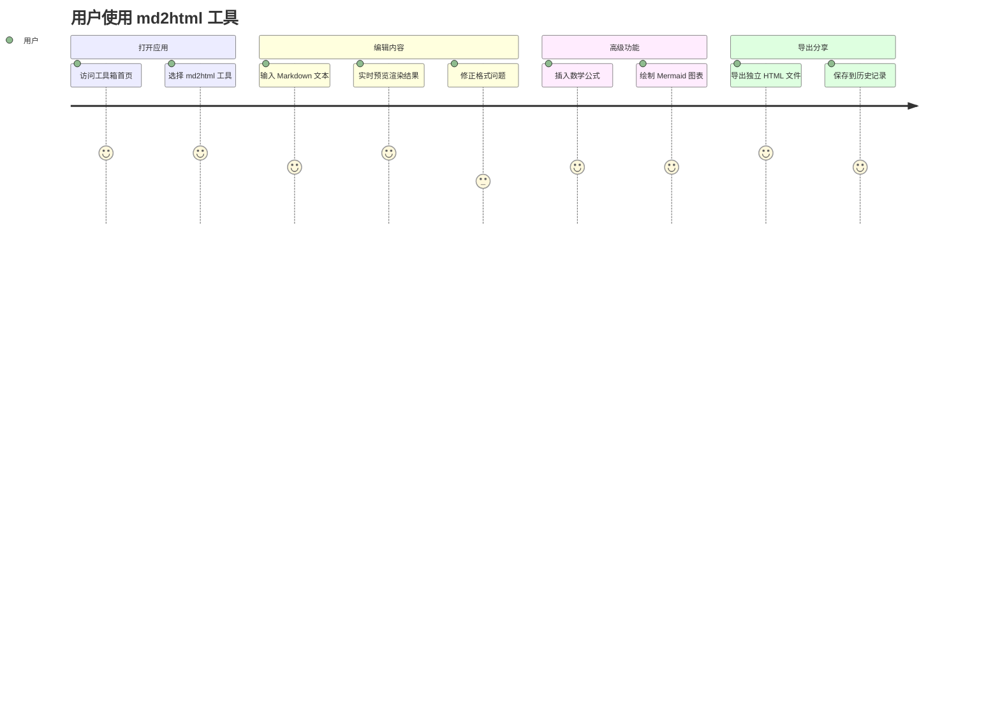

# Markdown 功能测试文档

> 本文档用于全面测试 md2html 工具的渲染能力，涵盖标题、代码块、Mermaid 图表、数学公式、表格、列表等核心要素。

---

## 1. 标题层级

# 一级标题
## 二级标题
### 三级标题
#### 四级标题
##### 五级标题
###### 六级标题

---

## 2. 文本格式

**粗体文本**、*斜体文本*、***粗斜体***、~~删除线~~、`行内代码`

普通段落文本，包含 [超链接](https://example.com) 和自动链接 <https://github.com>。

> 这是一段引用文本。
> 
> 引用中可以包含 **粗体** 和 `代码`。
>
> > 嵌套引用

---

## 3. 代码块

### 3.1 Go

```go
package main

import (
	"fmt"
	"sync"
	"time"
)

// Worker 工作协程
func Worker(id int, jobs <-chan int, results chan<- int, wg *sync.WaitGroup) {
	defer wg.Done()
	for job := range jobs {
		fmt.Printf("Worker %d processing job %d\n", id, job)
		time.Sleep(time.Millisecond * 100)
		results <- job * 2
	}
}

func main() {
	const numJobs = 10
	const numWorkers = 3

	jobs := make(chan int, numJobs)
	results := make(chan int, numJobs)
	var wg sync.WaitGroup

	// 启动 worker 协程池
	for w := 1; w <= numWorkers; w++ {
		wg.Add(1)
		go Worker(w, jobs, results, &wg)
	}

	// 发送任务
	for j := 1; j <= numJobs; j++ {
		jobs <- j
	}
	close(jobs)

	// 等待所有 worker 完成
	wg.Wait()
	close(results)

	// 收集结果
	for r := range results {
		fmt.Printf("Result: %d\n", r)
	}
}
```

### 3.2 C

```c
#include <stdio.h>
#include <stdlib.h>
#include <string.h>

#define MAX_LEN 256

// 双向链表节点
typedef struct Node {
    char data[MAX_LEN];
    struct Node *prev;
    struct Node *next;
} Node;

// 创建新节点
Node *create_node(const char *data) {
    Node *node = (Node *)malloc(sizeof(Node));
    if (!node) {
        fprintf(stderr, "Memory allocation failed\n");
        exit(EXIT_FAILURE);
    }
    strncpy(node->data, data, MAX_LEN - 1);
    node->data[MAX_LEN - 1] = '\0';
    node->prev = NULL;
    node->next = NULL;
    return node;
}

// 在链表尾部插入节点
void append(Node **head, const char *data) {
    Node *new_node = create_node(data);
    if (*head == NULL) {
        *head = new_node;
        return;
    }
    Node *current = *head;
    while (current->next != NULL) {
        current = current->next;
    }
    current->next = new_node;
    new_node->prev = current;
}

// 打印链表
void print_list(Node *head) {
    Node *current = head;
    while (current != NULL) {
        printf("[%s]", current->data);
        if (current->next) printf(" <-> ");
        current = current->next;
    }
    printf("\n");
}

int main(void) {
    Node *list = NULL;
    append(&list, "Hello");
    append(&list, "World");
    append(&list, "C Language");
    print_list(list);
    return 0;
}
```

### 3.3 C++

```cpp
#include <iostream>
#include <vector>
#include <algorithm>
#include <memory>
#include <functional>

// 模板类：简单的事件系统
template<typename... Args>
class EventEmitter {
public:
    using Callback = std::function<void(Args...)>;

    void on(const std::string &event, Callback cb) {
        listeners_[event].push_back(std::move(cb));
    }

    void emit(const std::string &event, Args... args) {
        auto it = listeners_.find(event);
        if (it != listeners_.end()) {
            for (const auto &cb : it->second) {
                cb(args...);
            }
        }
    }

private:
    std::map<std::string, std::vector<Callback>> listeners_;
};

// RAII 资源管理示例
class FileResource {
public:
    explicit FileResource(const std::string &path)
        : file_(std::fopen(path.c_str(), "r")) {
        if (!file_) throw std::runtime_error("Cannot open: " + path);
        std::cout << "Opened: " << path << std::endl;
    }
    ~FileResource() {
        if (file_) {
            std::fclose(file_);
            std::cout << "File closed" << std::endl;
        }
    }
    // 禁止拷贝
    FileResource(const FileResource &) = delete;
    FileResource &operator=(const FileResource &) = delete;
private:
    std::FILE *file_;
};

int main() {
    EventEmitter<std::string, int> emitter;

    emitter.on("message", [](const std::string &msg, int code) {
        std::cout << "[" << code << "] " << msg << std::endl;
    });

    emitter.emit("message", "Hello C++", 200);
    emitter.emit("message", "Error occurred", 500);

    // 智能指针 + RAII
    try {
        auto resource = std::make_unique<FileResource>("/tmp/test.txt");
    } catch (const std::exception &e) {
        std::cerr << e.what() << std::endl;
    }

    return 0;
}
```

### 3.4 Java

```java
import java.util.*;
import java.util.concurrent.*;
import java.util.stream.*;

/**
 * 并发任务调度器
 * 支持任务优先级、依赖关系和超时控制
 */
public class TaskScheduler {
    private final PriorityBlockingQueue<Task> taskQueue;
    private final ThreadPoolExecutor executor;
    private final Map<String, TaskResult> completedTasks;

    public TaskScheduler(int poolSize) {
        this.taskQueue = new PriorityBlockingQueue<>(11,
            Comparator.comparingInt(Task::getPriority).reversed()
        );
        this.executor = new ThreadPoolExecutor(
            poolSize, poolSize * 2, 60L, TimeUnit.SECONDS,
            new LinkedBlockingQueue<>(1000),
            new ThreadPoolExecutor.CallerRunsPolicy()
        );
        this.completedTasks = new ConcurrentHashMap<>();
    }

    public CompletableFuture<TaskResult> submit(Task task) {
        return CompletableFuture.supplyAsync(() -> {
            try {
                TaskResult result = task.execute();
                completedTasks.put(task.getId(), result);
                return result;
            } catch (Exception e) {
                throw new CompletionException(e);
            }
        }, executor).orTimeout(task.getTimeout(), TimeUnit.SECONDS);
    }

    public List<TaskResult> getCompletedResults() {
        return completedTasks.values().stream()
            .sorted(Comparator.comparingLong(TaskResult::getTimestamp))
            .collect(Collectors.toList());
    }

    public void shutdown() {
        executor.shutdown();
        try {
            if (!executor.awaitTermination(10, TimeUnit.SECONDS)) {
                executor.shutdownNow();
            }
        } catch (InterruptedException e) {
            executor.shutdownNow();
            Thread.currentThread().interrupt();
        }
    }

    // 内部类：任务定义
    static class Task implements Comparable<Task> {
        private final String id;
        private final int priority;
        private final long timeout;
        private final Callable<TaskResult> action;

        @Override
        public int compareTo(Task other) {
            return Integer.compare(other.priority, this.priority);
        }

        public int getPriority() { return priority; }
        public String getId() { return id; }
        public long getTimeout() { return timeout; }

        public TaskResult execute() throws Exception {
            return action.call();
        }
    }

    static class TaskResult {
        private final String taskId;
        private final Object data;
        private final long timestamp;

        public TaskResult(String taskId, Object data) {
            this.taskId = taskId;
            this.data = data;
            this.timestamp = System.currentTimeMillis();
        }

        public long getTimestamp() { return timestamp; }
    }
}
```

### 3.5 Python

```python
import asyncio
from dataclasses import dataclass, field
from typing import Optional, AsyncIterator
from datetime import datetime

@dataclass
class Metric:
    """时序指标数据点"""
    name: str
    value: float
    timestamp: datetime = field(default_factory=datetime.now)
    tags: dict = field(default_factory=dict)

class MetricStream:
    """异步指标流处理器"""

    def __init__(self, buffer_size: int = 1000):
        self._buffer: asyncio.Queue[Metric] = asyncio.Queue(buffer_size)
        self._subscribers: list[asyncio.Queue[Metric]] = []
        self._running = False

    async def start(self) -> None:
        """启动流处理器"""
        self._running = True
        asyncio.create_task(self._dispatch_loop())

    async def stop(self) -> None:
        """优雅关闭"""
        self._running = False
        for sub in self._subscribers:
            await sub.put(None)  # sentinel

    async def push(self, metric: Metric) -> None:
        """推入指标数据"""
        await self._buffer.put(metric)

    def subscribe(self) -> asyncio.Queue[Metric]:
        """订阅指标流"""
        q: asyncio.Queue[Optional[Metric]] = asyncio.Queue()
        self._subscribers.append(q)
        return q

    async def _dispatch_loop(self) -> None:
        """内部调度循环"""
        while self._running:
            try:
                metric = await asyncio.wait_for(
                    self._buffer.get(), timeout=1.0
                )
                for sub in self._subscribers:
                    await sub.put(metric)
            except asyncio.TimeoutError:
                continue

    async def aggregate(
        self,
        window: float = 5.0
    ) -> AsyncIterator[dict]:
        """滑动窗口聚合"""
        q = self.subscribe()
        window_data: list[Metric] = []
        cutoff = datetime.now().timestamp() - window

        while True:
            item = await q.get()
            if item is None:
                break
            if item.timestamp.timestamp() >= cutoff:
                window_data.append(item)

            # 计算窗口统计
            if window_data:
                values = [m.value for m in window_data]
                yield {
                    "name": window_data[0].name,
                    "count": len(values),
                    "avg": sum(values) / len(values),
                    "min": min(values),
                    "max": max(values),
                }


async def main():
    stream = MetricStream()
    await stream.start()

    # 模拟指标推送
    for i in range(10):
        m = Metric(name="cpu", value=0.5 + i * 0.05, tags={"host": "node1"})
        await stream.push(m)

    # 消费聚合结果
    q = stream.subscribe()
    while True:
        item = await q.get()
        if item is None:
            break
        print(f"[{item.timestamp}] {item.name}={item.value:.2f}")

    await stream.stop()

if __name__ == "__main__":
    asyncio.run(main())
```

---

## 4. Mermaid 图表

### 4.1 流程图 (Flowchart)



### 4.2 时序图 (Sequence Diagram)



### 4.3 类图 (Class Diagram)

```mermaid
classDiagram
    class Handler {
        +RespondJSON(c *gin.Context, data interface{})
        +RespondError(c *gin.Context, code int, msg string)
    }

    class AuthHandler {
        -userService UserService
        +Register(c *gin.Context)
        +Login(c *gin.Context)
        +Profile(c *gin.Context)
    }

    class ConvertHandler {
        -convertService ConvertService
        +Convert(c *gin.Context)
    }

    class HistoryHandler {
        -historyService HistoryService
        +List(c *gin.Context)
        +Save(c *gin.Context)
        +Delete(c *gin.Context)
    }

    class UserService {
        <<interface>>
        +Register(req RegisterRequest) (*User, string, error)
        +Login(email, password string) (*User, string, error)
        +GetByID(id int64) (*User, error)
    }

    class ConvertService {
        <<interface>>
        +Convert(markdown string) (string, error)
    }

    class HistoryService {
        <<interface>>
        +ListByUser(userID int64, page, size int) (*HistoryPageResult, error)
        +Save(userID int64, req SaveRequest) (*Conversion, error)
        +Delete(userID int64, id int64) error
    }

    Handler <|-- AuthHandler
    Handler <|-- ConvertHandler
    Handler <|-- HistoryHandler
    AuthHandler --> UserService
    ConvertHandler --> ConvertService
    HistoryHandler --> HistoryService
```

### 4.4 状态图 (State Diagram)



### 4.5 甘特图 (Gantt Chart)



### 4.6 饼图 (Pie Chart)



### 4.7 ER 图 (Entity Relationship)



### 4.8 用户旅程图 (Journey)



---

## 5. 数学公式

### 5.1 行内公式

质能方程 $E = mc^2$，欧拉公式 $e^{i\pi} + 1 = 0$，二次方程求根公式 $x = \frac{-b \pm \sqrt{b^2 - 4ac}}{2a}$。

### 5.2 块级公式

**傅里叶变换：**

$$
\hat{f}(\xi) = \int_{-\infty}^{\infty} f(x)\, e^{-2\pi i x \xi} \, dx
$$

**高斯积分：**

$$
\int_{-\infty}^{\infty} e^{-x^2} \, dx = \sqrt{\pi}
$$

**麦克斯韦方程组：**

$$
\begin{aligned}
\nabla \cdot \mathbf{E} &= \frac{\rho}{\varepsilon_0} \\
\nabla \cdot \mathbf{B} &= 0 \\
\nabla \times \mathbf{E} &= -\frac{\partial \mathbf{B}}{\partial t} \\
\nabla \times \mathbf{B} &= \mu_0 \mathbf{J} + \mu_0 \varepsilon_0 \frac{\partial \mathbf{E}}{\partial t}
\end{aligned}
$$

**矩阵运算：**

$$
A = \begin{pmatrix} a_{11} & a_{12} & a_{13} \\ a_{21} & a_{22} & a_{23} \\ a_{31} & a_{32} & a_{33} \end{pmatrix}, \quad \det(A) = \sum_{\sigma \in S_n} \text{sgn}(\sigma) \prod_{i=1}^{n} a_{i,\sigma(i)}
$$

**概率与统计：**

$$
P(A|B) = \frac{P(B|A) \cdot P(A)}{P(B)} = \frac{P(B|A) \cdot P(A)}{\sum_{i} P(B|A_i) \cdot P(A_i)}
$$

**求和与极限：**

$$
\sum_{n=1}^{\infty} \frac{1}{n^2} = \frac{\pi^2}{6}, \qquad \lim_{n \to \infty} \left(1 + \frac{1}{n}\right)^n = e
$$

---

## 6. 表格

### 6.1 技术栈对比

| 特性 | Vue 3 | React | Svelte |
|------|-------|-------|--------|
| 类型 | 响应式 | 声明式 | 编译式 |
| 虚拟 DOM | ✅ | ✅ | ❌ |
| 包体积 | ~33KB | ~42KB | ~2KB |
| 学习曲线 | 中等 | 中等 | 低 |
| TypeScript | ✅ | ✅ | ✅ |
| 状态管理 | Pinia | Redux/Zustand | 内置 |

### 6.2 API 接口列表

| 方法 | 路径 | 认证 | 说明 |
|:----:|------|:----:|------|
| `GET` | `/api/health` | ❌ | 健康检查 |
| `POST` | `/api/auth/register` | ❌ | 用户注册 |
| `POST` | `/api/auth/login` | ❌ | 用户登录 |
| `GET` | `/api/auth/profile` | ✅ | 获取用户信息 |
| `POST` | `/api/tools/md2html/convert` | ❌ | Markdown 转换 |
| `GET` | `/api/tools/md2html/history` | ✅ | 获取历史记录 |
| `DELETE` | `/api/tools/md2html/history/:id` | ✅ | 删除历史 |

---

## 7. 列表

### 7.1 无序列表

- 前端框架
  - Vue 3
    - Composition API
    - Pinia 状态管理
    - Vue Router 4
  - React
    - Hooks
    - Redux / Zustand
  - Svelte
- 后端语言
  - Go
  - Rust
  - Python

### 7.2 有序列表

1. 初始化项目
2. 配置开发环境
   1. 安装 Node.js 18+
   2. 安装 Go 1.22+
   3. 配置 MySQL 8.0
3. 启动开发服务
4. 编写业务代码
5. 测试与部署

### 7.3 任务列表

- [x] 搭建后端项目脚手架
- [x] 实现数据模型和数据库 Schema
- [x] 实现中间件层
- [x] 实现 Service 层
- [x] 实现 Handler 和 Router 层
- [x] 搭建前端 Vue 3 项目
- [x] 迁移核心渲染管线
- [x] 迁移交互功能
- [ ] 端到端联调测试
- [ ] 生产环境部署

---

## 8. 图片与链接


| [Vue 官网](https://vuejs.org) | [Go 官网](https://go.dev) | [Markdown 指南](https://www.markdownguide.org) |

---

## 9. 分隔线与脚注

---

这是一个带脚注的文本[^1]，还有另一个脚注[^2]。

[^1]: 这是第一个脚注内容，用于测试脚注渲染。
[^2]: 这是第二个脚注，支持 **Markdown 格式**。

---

## 10. 混合测试

### 代码 + 公式混合

牛顿第二定律 $F = ma$ 在代码中的实现：

```python
def calculate_force(mass: float, acceleration: float) -> float:
    """F = ma"""
    return mass * acceleration

# 当 $m = 10\,\text{kg}$, $a = 9.8\,\text{m/s}^2$ 时:
force = calculate_force(10, 9.8)
print(f"F = {force} N")  # F = 98.0 N
```

### 表格内代码

| 语言 | 变量声明 | 打印输出 |
|------|----------|----------|
| Go | `var x int := 10` | `fmt.Println(x)` |
| C | `int x = 10;` | `printf("%d", x);` |
| C++ | `int x = 10;` | `std::cout << x;` |
| Java | `int x = 10;` | `System.out.println(x);` |
| Python | `x = 10` | `print(x)` |

### 引用中的代码和公式

> 算法复杂度：快速排序的平均时间复杂度为 $O(n \log n)$，最坏情况为 $O(n^2)$。
>
> ```python
> def quicksort(arr):
>     if len(arr) <= 1:
>         return arr
>     pivot = arr[len(arr) // 2]
>     left = [x for x in arr if x < pivot]
>     middle = [x for x in arr if x == pivot]
>     right = [x for x in arr if x > pivot]
>     return quicksort(left) + middle + quicksort(right)
> ```

---

## 11. 特殊字符与转义

| 字符 | HTML 实体 | 渲染结果 |
|------|-----------|----------|
| 小于号 | `&lt;` | < |
| 大于号 | `&gt;` | > |
| &符号 | `&amp;` | & |
| 引号 | `&quot;` | " |
| 空格 | `&nbsp;` | A&nbsp;&nbsp;&nbsp;B |

---

*— 文档结束 —*
